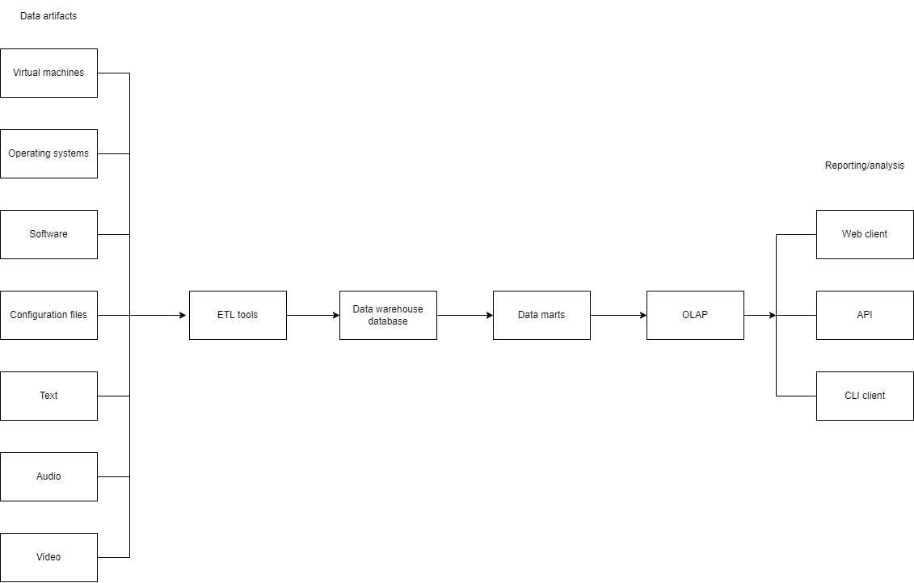

# Test task sumbission

## 1. User stories
- As a regular user, I want to access the name, version and checksum of an artifact, so that I gain general info about the artifact. 
- As an administrator, I want to configure the authentication, so that I can choose which data is retrieved from external authentication services. 
- As the owner of an artifact, I want to set the access rule set on my artifact, so that I can control who is able to download the artifact. 

## 2. Data architecture

## 3. Clarifying questions

- What information should should be stored for the artifacts, in addition to the name, version and checksum?
- What are the actual user roles, who will be using the data warehouse? Specialists, analysts, other workers?
- It was said that artifacts can be downloaded depending on the access rule set, all other actions can only be performed by the author and that administrators can access 
all the operations on all the artifacts without authorization. What are these other actions and operations?
